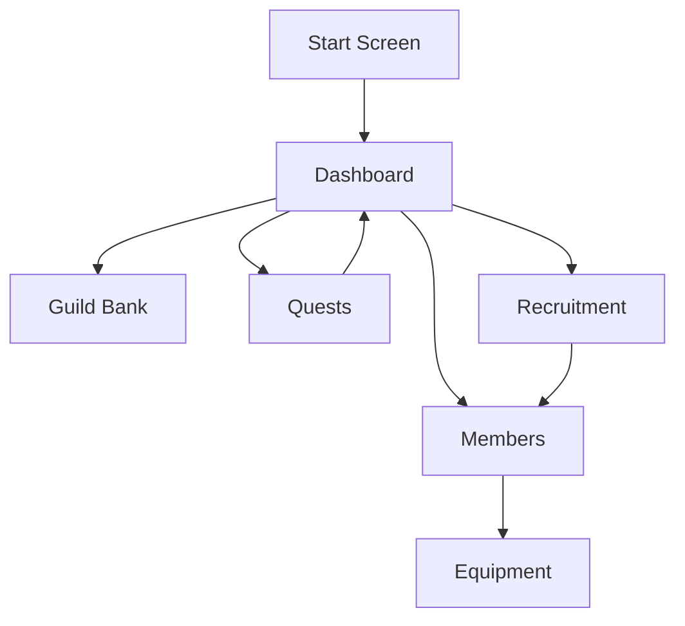

# Guild Manager Wiki

# Welcome to the Guild Manager project wiki.

This wiki will include information from my original README.md, the updated README.md which includes a technical architecture overview as well as a Changelog, and finally, include edited material not included in either of the previous README.md files.

Thank you to my friends in the industry who helped me with advice and guidance throughout this project.

# Project Outline (for submission)
## Project Description
The game mimics the daily actions of managing a guild: organizing members, dispatching quest parties, building notoriety, collecting items, and training members to become stronger.

## Problem Addressing
The project is designed for players who still enjoy game worlds and RPG progression but may not have time or energy for long play sessions. The goal is to create a casual experience that feels inspired by MMORPG guild management without requiring constant attention.

## Platform
The app is built for Android using Kotlin. The course is based on Android mobile development, so Android is the primary platform for development, testing, and deployment.

## Front/Back end support
This app uses Jetpack Compose instead of Java Fragments for the front end. 

The front end is contained within 2 folders:
- components
- screens

The back end is currently supported with static data being held in kotlin files, SQLite and a combination of the `GameManager.kt` and `SaveManager.kt` to manage persistence and data during runtime.

### Components

The Components folder holds one-time-use and reusable screen components that the app uses to draw screens. For example, `TopStatusBar.kt` pulls and displays the Guild Name, Gold, Fame, as well as holding a place for the Sidebar menu at the top left.

### Screens
This is where all the screens are laid out via `@Composable` functions, replacing XML files and Fragments. Jetpack Composes uses these functions to 
create what the user sees.

Screens are also managed by the `GuildManagerApp.kt` file, and use an enum stored in `models/AppScreen.kt` to easily assign a file from `/screens` to the appropriate display within the code.

## Functionality

- create a new guild or load demo data
- view guild progress from the Dashboard
- manage inventory in the Guild Bank
- view and manage guild members
- equip and unequip items
- send members on timed quests
- recruit new guild members
- save and load local progress
- 
## Design (wireframes)

For an updated view of the design, please see the Project wiki at: https://github.com/LuisBarbaMartin/COM-437_Term_Project/wiki

### Screen 1: Start Screen

```text
+------------------------------------------------+
|                                                |
|                                                |
|                                                |
|                                                |
|                  +----------+                  |
|                  |  START   |                  |
|                  +----------+                  |
|                                                |
|                                                |
|                                                |
|                                                |
|                                                |
|                                                |
|                                                |
|                                                |
|                                                |
|                                                |
|                                                |
|                                                |
|                                                |
|                                                |
|                                                |
|                                                |
+------------------------------------------------+
```
The landing screen users will see when they first start the app. There will be artwork displayed here establishing the theme/lore of the app. <br>

### Screen 2: Dashboard
```
+------------------------------------------------+
| guild_name          fame: #        currency: # |
+------------------------------------------------+
| active_quest_focus_panel                       |
|                                                |
|                                                |
|                                                |
+------------------------------------------------+
| roster                                         |
|                                                |
|                                                |
|                                                |
|                                                |
|                                                |
|                                                |
|                                                |
|                                                |
|                                                |
|                                                |
|                                                |
|                                                |
+------------------------------------------------+
| guild bank  |  members  |  quests  | recruit   |
|                                                |
|                                                |
|                                                |
|                                                |
+------------------------------------------------+
```
This will be the first screen users will see after passing the Start Screen. <br>
This screen will display the Guild name the user chose, as well as their total fame or fame level (to be determined), and their total currency. <br>

A row of menu navigation tables are visible at the bottom of the screen, allowing the user to navigate the various panels required to use the app. <br>


### Screen 3: Guild Bank Tab
```
+------------------------------------------------+
| guild_name          fame: #        currency: # |
+------------------------------------------------+
| guild_bank                                     |
|                                                |
| +--------------------------------------------+ |
| |                                            | |
| |       grid-based inventory system          | |
| |       with organizable tabs                | |
| |                                            | |
| |       weapons | armor | items | misc       | |
| |                                            | |
| |                                            | |
| |                                            | |
| +--------------------------------------------+ |
|                                                |
|                                                |
|                                                |
|                                                |
|                                                |
|                                                |
|                                                |
|                                                |
|                                                |
|                                                |
|                                                |
+------------------------------------------------+
| guild bank  |  members  |  quests  | recruit   |
+------------------------------------------------+
```
The Guild Bank tab displays the guild inventory.  <br>
Items will be shown in a grid layout and organized into categories such as weapons, armor, items, and miscellaneous items. <br>

### Screen 4: Members Tab
```
+------------------------------------------------+
| guild_name          fame: #        currency: # |
+------------------------------------------------+
| members                                        |
|                                                |
| +--------------------------------------------+ |
| |                                            | |
| |   scrolling roster of recruited guild      | |
| |   members                                  | |
| |                                            | |
| |   [ Member 1 ]                             | |
| |   [ Member 2 ]                             | |
| |   [ Member 3 ]                             | |
| |                                            | |
| |   tapping a member opens customization     | |
| |                                            | |
| |                                            | |
| |                                            | |
| +--------------------------------------------+ |
|                                                |
|                                                |
|                                                |
|                                                |
|                                                |
|                                                |
|                                                |
+------------------------------------------------+
| guild bank  |  members  |  quests  | recruit   |
+------------------------------------------------+
```
The Members tab allows the user to view all recruited guild members. Tapping a member opens their customization or detail panel. <br>

### Screen 5: Quests Tab
```
+------------------------------------------------+
| guild_name          fame: #        currency: # |
+------------------------------------------------+
| quests                                         |
|                                                |
| +--------------------------------------------+ |
| |                                            | |
| |   scrollable list of available quests      | |
| |                                            | |
| |   [ Quest 1 ]                              | |
| |   [ Quest 2 ]                              | |
| |   [ Quest 3 ]                              | |
| |                                            | |
| |   tapping a quest expands details, stat    | |
| |   requirements, rewards, and member slots  | |
| |                                            | |
| |                                            | |
| |                                            | |
| |                                            | |
| +--------------------------------------------+ |
|                                                |
|                                                |
|                                                |
|                                                |
|                                                |
|                                                |
|                                                |
|                                                |
|                                                |

+------------------------------------------------+
| guild bank  |  members  |  quests  | recruit   |
+------------------------------------------------+
```
The Quests tab displays available quests. The user can review quest details, requirements, rewards, and assign guild members to quest slots. <br>

### Screen 6: Recruitment Tab
```
+------------------------------------------------+
| guild_name          fame: #        currency: # |
+------------------------------------------------+
| recruitment                                    |
|                                                |
| +--------------------------------------------+ |
| |                                            | |
| |   as guild fame increases, more NPC        | |
| |   applicants become available              | |
| |                                            | |
| |   [ Applicant 1 ]                          | |
| |   [ Applicant 2 ]                          | |
| |   [ Applicant 3 ]                          | |
| |                                            | |
| |   view stats, traits, and preferences      | |
| |                                            | |
| |   [ Accept ]                [ Decline ]    | |
| |                                            | |
| +--------------------------------------------+ |
|                                                |
|                                                |
|                                                |
|                                                |
|                                                |
|                                                |
|                                                |
+------------------------------------------------+
| guild bank  |  members  |  quests  | recruit   |
+------------------------------------------------+
```
The Recruitment tab allows the user to review NPC applicants and choose whether to accept or decline them. Recruiting members helps the guild grow and complete harder quests. <br>

### Screen 7: Member Selection/Dispatch Screen
```
+------------------------------------------------+
| guild_name          fame: #        currency: # |
+------------------------------------------------+
| select member for quest                        |
|                                                |
| +--------------------------------------------+ |
| |                                            | |
| |   [ Member 1 ]                             | |
| |   stats: STR #  INT #  AGI #  WIS #        | |
| |                                            | |
| |   [ Member 2 ]                             | |
| |   stats: STR #  INT #  AGI #  WIS #        | |
| |                                            | |
| |   [ Member 3 ]                             | |
| |   stats: STR #  INT #  AGI #  WIS #        | |
| |                                            | |
| |   [ Confirm Selection ]                    | |
| |                                            | |
| +--------------------------------------------+ |
|                                                |
|                                                |
|                                                |
|                                                |
|                                                |
|                                                |
|                                                |
+------------------------------------------------+
| guild bank  |  members  |  quests  | recruit   |
+------------------------------------------------+
```
The Member Selection screen appears when the user chooses a quest slot. It allows the user to select which guild member should be dispatched. <br>

### Screen 8: Member Customization Panel
```
+------------------------------------------------+
| guild_name          fame: #        currency: # |
+------------------------------------------------+
| member details                                 |
|                                                |
| +--------------------------------------------+ |
| | name: Member Name                          | |
| | class/type: Member Class                   | |
| | level: #                                   | |
| |                                            | |
| | stats:                                     | |
| | STR: #                                     | |
| | INT: #                                     | |
| | AGI: #                                     | |
| | WIS: #                                     | |
| |                                            | |
| | equipment:                                 | |
| | weapon: item name                          | |
| | armor: item name                           | |
| | accessory: item name                       | |
| |                                            | |
| | [ Customize ]              [ Back ]        | |
| |                                            | |
| +--------------------------------------------+ |
|                                                |
+------------------------------------------------+
| guild bank  |  members  |  quests  | recruit   |
+------------------------------------------------+
```
The Member Customization panel displays information about a selected guild member, including stats, level, class, and equipment. <br>

## User Flow


