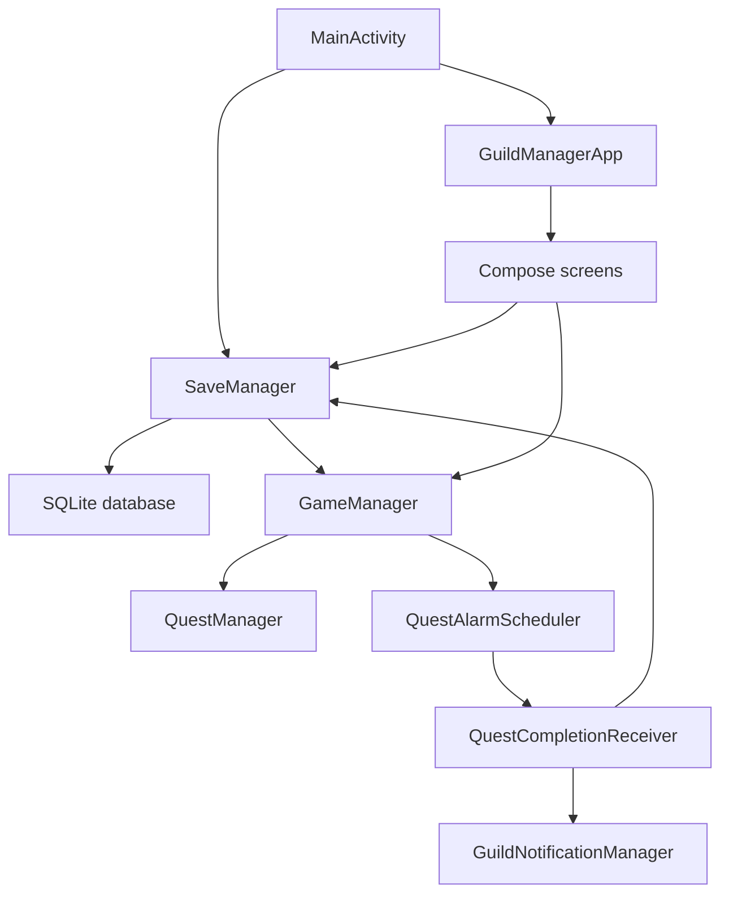
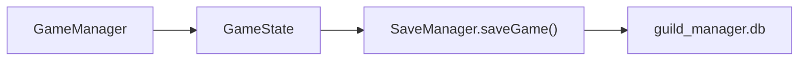
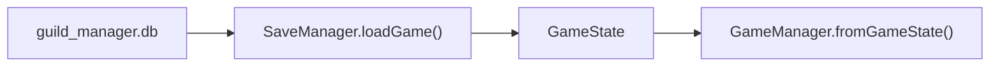
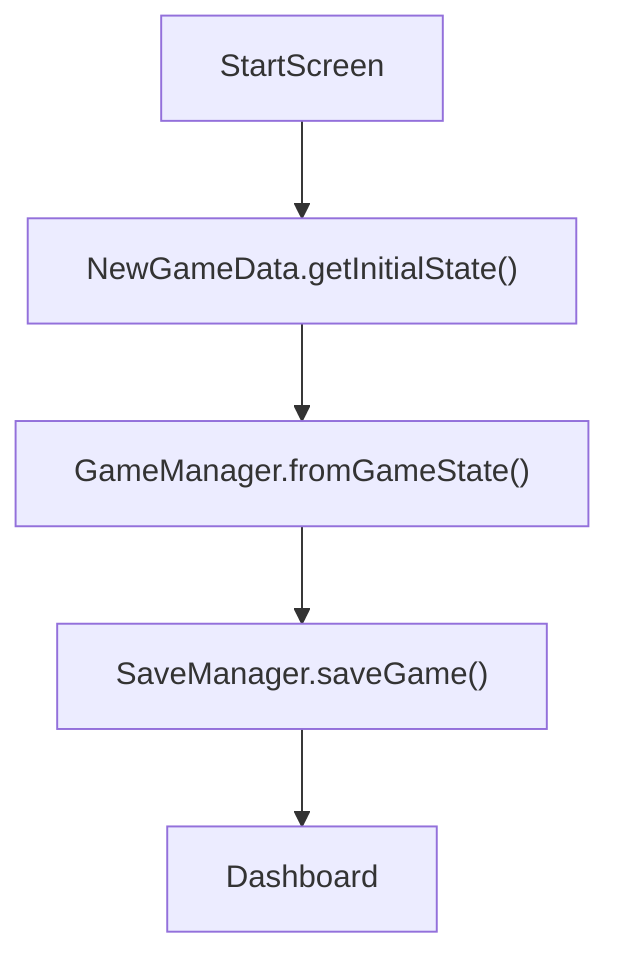
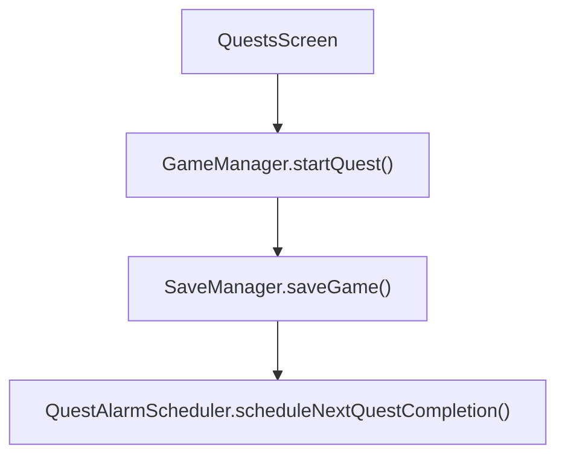
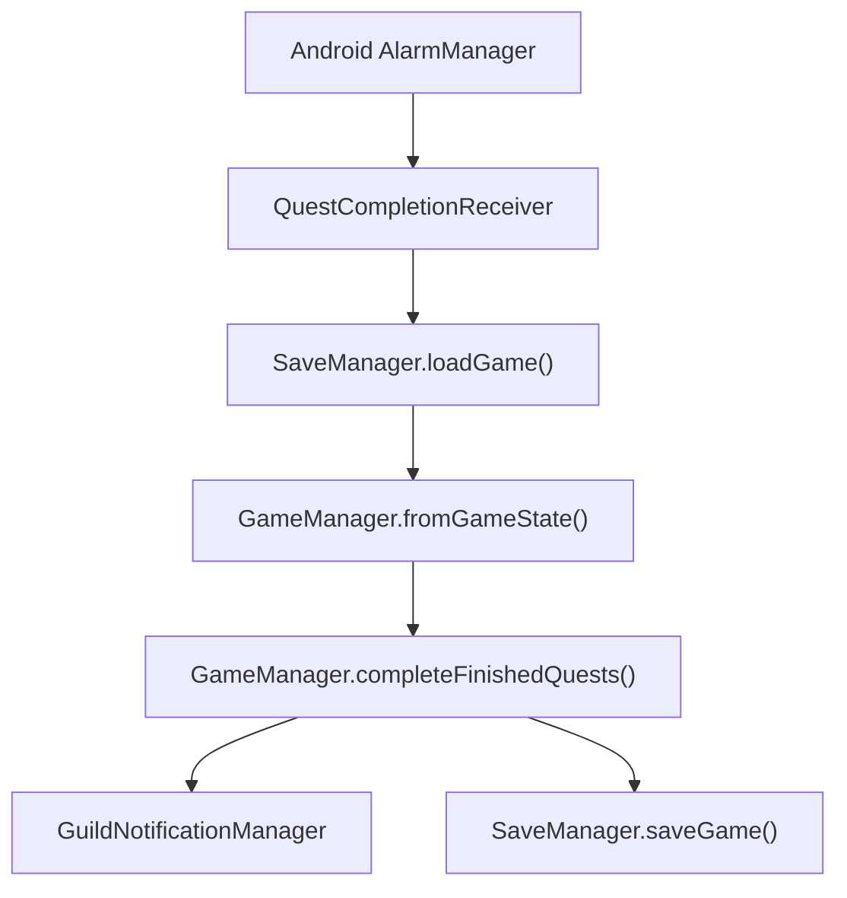

# COM-437-26SU1-TermProject
This is a GitHub repo for my COM-437 term project.

## Project description
IDLE-MMO-Manager is an **incremental game** that mimics the daily actions of running a Guild, organizing events, and dispatching your guild members on quests to not only build value in your guild bank, but also gain noteriety, and train your guild members to become stronger. <br>

### What is an Incremental Game?
An incremental game is one that steadily unlocks progress over time. They do not require active game play to increase this progress, instead, they offer an experience that allows a user to set up tasks that are completed over a defined, or indefinite period of time. <br>

They're not intended to be played like traditional games where you sit and focus for extended periods of time. Instead, a user can queue tasks, close/leave the game, and return hours/days later to reap the rewards of their offline progress. <br>

## Problem addressing
As I've grown older, I've lost the ability to play games as often as I would like, as well the enthusiasm required to "get good" at games by pouring hundreds of hours into a single game. What I haven't lost is the love for gaming, and their settings. <br>

By creating an incremental game, I intend to create a casual experience that mimics the experience of playing an **MMORPG**. <br>

## Platform
This app will begin to be developed with Android SDK, for the Android Mobile platform. Since the course is based on Mobile App Development for Android, that will be the primary platfom for development, testing, and deployment. <br>


## Front/Back end support
I am considering using Java/Kotlin to build the project, but at my current stage in learning, i'm must comfortable with HTML/CSS/JS (vanilla + React), and Python + Flask for constructing websites. If I can find a way to use these languages for the assignment, that would be my preferred method of building the app. <br>

## Functionality
IDLE-MMO-Manager allows the user to manage a fantasy guild through multiple app screens. Upon starting the app, the user is presented with a start screen that will allow for a new save, or demo info to be selected. Once inside the game, the user is presented with a dashboard that displays all core information they need to manage their guild. They'll be able to manage their bank (inventory), send Guild Members out on quests to complete, and access the recruitment screen to add new members to their Guild.

## Kotlin vs Java
Since I am writing this project in Kotlin instead of Java, I will explain in this section how I bridge the concepts from the class to a different language.
- MainActivity.kt represents the main Android activity.
- Instead of using setContentView() to load an XML layout, I am using setContent{} to load the Compose user interface. The app screens (Home, Bank, Guild, Quest, Hire (all names subject to change)) are written as compose functions instead of seperate XML layouts.
- Instead of XML layouts and traditional View objects, the app uses composables like Column, Row, Box, Text, Button, Image, and Card.
- Instead of using fragments for UI sections, the app uses a screen state system with an AppScreen enum and composable screen functions.
- lazyColumn is used in lieu of ListView for infinite scrolling on the Guild Bank page.

## Design (wireframes)

### Screen 1: Start Screen

```text
+------------------------------------------------+
|                                                |
|                                                |
|                                                |
|                                                |
|                  +----------+                  |
|                  |  START   |                  |
|                  +----------+                  |
|                                                |
|                                                |
|                                                |
|                                                |
|                                                |
|                                                |
|                                                |
|                                                |
|                                                |
|                                                |
|                                                |
|                                                |
|                                                |
|                                                |
|                                                |
|                                                |
+------------------------------------------------+
```
The landing screen users will see when they first start the app. There will be artwork displayed here establishing the theme/lore of the app. <br>

### Screen 2: Dashboard
```
+------------------------------------------------+
| guild_name          fame: #        currency: # |
+------------------------------------------------+
| active_quest_focus_panel                       |
|                                                |
|                                                |
|                                                |
+------------------------------------------------+
| roster                                         |
|                                                |
|                                                |
|                                                |
|                                                |
|                                                |
|                                                |
|                                                |
|                                                |
|                                                |
|                                                |
|                                                |
|                                                |
+------------------------------------------------+
| guild bank  |  members  |  quests  | recruit   |
|                                                |
|                                                |
|                                                |
|                                                |
+------------------------------------------------+
```
This will be the first screen users will see after passing the Start Screen. <br>
This screen will display the Guild name the user chose, as well as their total fame or fame level (to be determined), and their total currency. <br>

A row of menu navigation tables are visible at the bottom of the screen, allowing the user to navigate the various panels required to use the app. <br>


### Screen 3: Guild Bank Tab
```
+------------------------------------------------+
| guild_name          fame: #        currency: # |
+------------------------------------------------+
| guild_bank                                     |
|                                                |
| +--------------------------------------------+ |
| |                                            | |
| |       grid-based inventory system          | |
| |       with organizable tabs                | |
| |                                            | |
| |       weapons | armor | items | misc       | |
| |                                            | |
| |                                            | |
| |                                            | |
| +--------------------------------------------+ |
|                                                |
|                                                |
|                                                |
|                                                |
|                                                |
|                                                |
|                                                |
|                                                |
|                                                |
|                                                |
|                                                |
+------------------------------------------------+
| guild bank  |  members  |  quests  | recruit   |
+------------------------------------------------+
```
The Guild Bank tab displays the guild inventory.  <br>
Items will be shown in a grid layout and organized into categories such as weapons, armor, items, and miscellaneous items. <br>

### Screen 4: Members Tab
```
+------------------------------------------------+
| guild_name          fame: #        currency: # |
+------------------------------------------------+
| members                                        |
|                                                |
| +--------------------------------------------+ |
| |                                            | |
| |   scrolling roster of recruited guild      | |
| |   members                                  | |
| |                                            | |
| |   [ Member 1 ]                             | |
| |   [ Member 2 ]                             | |
| |   [ Member 3 ]                             | |
| |                                            | |
| |   tapping a member opens customization     | |
| |                                            | |
| |                                            | |
| |                                            | |
| +--------------------------------------------+ |
|                                                |
|                                                |
|                                                |
|                                                |
|                                                |
|                                                |
|                                                |
+------------------------------------------------+
| guild bank  |  members  |  quests  | recruit   |
+------------------------------------------------+
```
The Members tab allows the user to view all recruited guild members. Tapping a member opens their customization or detail panel. <br>

### Screen 5: Quests Tab
```
+------------------------------------------------+
| guild_name          fame: #        currency: # |
+------------------------------------------------+
| quests                                         |
|                                                |
| +--------------------------------------------+ |
| |                                            | |
| |   scrollable list of available quests      | |
| |                                            | |
| |   [ Quest 1 ]                              | |
| |   [ Quest 2 ]                              | |
| |   [ Quest 3 ]                              | |
| |                                            | |
| |   tapping a quest expands details, stat    | |
| |   requirements, rewards, and member slots  | |
| |                                            | |
| |                                            | |
| |                                            | |
| |                                            | |
| +--------------------------------------------+ |
|                                                |
|                                                |
|                                                |
|                                                |
|                                                |
|                                                |
|                                                |
|                                                |
|                                                |

+------------------------------------------------+
| guild bank  |  members  |  quests  | recruit   |
+------------------------------------------------+
```
The Quests tab displays available quests. The user can review quest details, requirements, rewards, and assign guild members to quest slots. <br>

### Screen 6: Recruitment Tab
```
+------------------------------------------------+
| guild_name          fame: #        currency: # |
+------------------------------------------------+
| recruitment                                    |
|                                                |
| +--------------------------------------------+ |
| |                                            | |
| |   as guild fame increases, more NPC        | |
| |   applicants become available              | |
| |                                            | |
| |   [ Applicant 1 ]                          | |
| |   [ Applicant 2 ]                          | |
| |   [ Applicant 3 ]                          | |
| |                                            | |
| |   view stats, traits, and preferences      | |
| |                                            | |
| |   [ Accept ]                [ Decline ]    | |
| |                                            | |
| +--------------------------------------------+ |
|                                                |
|                                                |
|                                                |
|                                                |
|                                                |
|                                                |
|                                                |
+------------------------------------------------+
| guild bank  |  members  |  quests  | recruit   |
+------------------------------------------------+
```
The Recruitment tab allows the user to review NPC applicants and choose whether to accept or decline them. Recruiting members helps the guild grow and complete harder quests. <br>

### Screen 7: Member Selection/Dispatch Screen
```
+------------------------------------------------+
| guild_name          fame: #        currency: # |
+------------------------------------------------+
| select member for quest                        |
|                                                |
| +--------------------------------------------+ |
| |                                            | |
| |   [ Member 1 ]                             | |
| |   stats: STR #  INT #  AGI #  WIS #        | |
| |                                            | |
| |   [ Member 2 ]                             | |
| |   stats: STR #  INT #  AGI #  WIS #        | |
| |                                            | |
| |   [ Member 3 ]                             | |
| |   stats: STR #  INT #  AGI #  WIS #        | |
| |                                            | |
| |   [ Confirm Selection ]                    | |
| |                                            | |
| +--------------------------------------------+ |
|                                                |
|                                                |
|                                                |
|                                                |
|                                                |
|                                                |
|                                                |
+------------------------------------------------+
| guild bank  |  members  |  quests  | recruit   |
+------------------------------------------------+
```
The Member Selection screen appears when the user chooses a quest slot. It allows the user to select which guild member should be dispatched. <br>

### Screen 8: Member Customization Panel
```
+------------------------------------------------+
| guild_name          fame: #        currency: # |
+------------------------------------------------+
| member details                                 |
|                                                |
| +--------------------------------------------+ |
| | name: Member Name                          | |
| | class/type: Member Class                   | |
| | level: #                                   | |
| |                                            | |
| | stats:                                     | |
| | STR: #                                     | |
| | INT: #                                     | |
| | AGI: #                                     | |
| | WIS: #                                     | |
| |                                            | |
| | equipment:                                 | |
| | weapon: item name                          | |
| | armor: item name                           | |
| | accessory: item name                       | |
| |                                            | |
| | [ Customize ]              [ Back ]        | |
| |                                            | |
| +--------------------------------------------+ |
|                                                |
+------------------------------------------------+
| guild bank  |  members  |  quests  | recruit   |
+------------------------------------------------+
```
The Member Customization panel displays information about a selected guild member, including stats, level, class, and equipment. <br>

# Glossary
Incremental Game - An incremental game is a video game subgenre characterized by the incremental accumulation of in-game resources, and gradual, often exponential progression through repetitive actions or automation. <br>

MMO - A massively multiplayer online (MMO) game, sometimes referred to as an MMOG, is an online video game with a large number of players to interact in the same online game world. <br>

MMORPG - A massively multiplayer online role-playing game (MMORPG) is a video game that combines aspects of a role-playing video game and a massively multiplayer online game (see MMO).  <br>

------------------------------

# Guild Manager App Architecture (The Technical Section)

My app is an Android based (kotlin) Guild Management game styled after the incremental game genre.

The Player can start a new save file, or load the Demo file for exhibition purposes.

## Selling This App
This is an incremental style game, encouraging players to use it for a small amount of time daily, sending their units out to complete tasks, and the user will then return to reap the rewards, and send their units back out on repeat.

### Things that need to be addressed for full functionality

## Main Idea

This app is organized into a few main parts that work together. The app starts through the main Android activity, which loads the rest of the project. From there, the user sees the different screens made with Jetpack Compose (as opposed to using Fragments in pure Java), such as the dashboard, members screen, quests screen, and guild bank.

The app also has manager files that handle the main game actions. These keep track of things like the guild’s members, gold, fame, quests, saving and loading data, notifications, and quest completion.

The model files define what the main objects are, such as guild members, inventory items, quests, and the overall game state. Finally, the data files hold the starter content for the game, including sample recruits, items, quests, and the beginning state of the guild.



## Android Entry Points

### `MainActivity.kt`

`MainActivity` is the main Android activity. Android opens it when the user taps the app icon or taps a notification.

It:

- creates `SaveManager`
- creates `GuildNotificationManager`
- creates `QuestAlarmScheduler`
- creates the notification channel
- asks for notification permission on Android 13+
- loads saved data from SQLite
- falls back to `NewGameData` when no save exists
- completes overdue quests after loading
- schedules the next quest-completion alarm
- starts the Compose UI with `GuildManagerApp`

When the app becomes invisible, `onStop()` saves the current state and reschedules quest alarms.

### `QuestCompletionReceiver.kt`

`QuestCompletionReceiver` is a `BroadcastReceiver`. It runs when Android delivers a scheduled quest alarm while the app is not visible.

It:

- loads saved game data
- puts it into `GameManager`
- completes finished quests
- sends notifications
- saves updated game state
- schedules the next quest alarm

This is what lets quests keep progressing while the app is closed or in the background.

## App Shell

### `GuildManagerApp.kt`

`GuildManagerApp` is the main Compose shell. It owns the current screen state using `AppScreen`.

This code controls:

- current screen
- navigation drawer/sidebar
- Save Game menu item
- screen navigation
- in-app quest completion checks while the app is open

The app uses `AppScreen` instead of fragments. Each enum value maps to one screen: `Start`, `Dashboard`, `GuildBank`, `Members`, `Equipment`, `Quests`, `Recruitment`, and `Settings`.

## Game State And Logic

### `GameManager.kt`

`GameManager` is the live in-memory state for the game.

It stores:

- guild name
- gold
- fame
- inventory
- guild members
- recruits
- active quests
- activity log

It also performs game actions:

- `toGameState()` creates a saveable snapshot.
- `fromGameState()` loads saved data into live state.
- `startQuest()` starts a timed quest.
- `equipItem()` equips an inventory item to a member.
- `unequipItem()` returns equipment to inventory.
- `completeFinishedQuests()` resolves quests whose timers ended.

### `QuestManager.kt`

`QuestManager` calculates quest results. `GameManager` uses it when completing a quest, then applies rewards, updates members, writes activity logs, and removes the active quest.

## Persistence

### `SaveManager.kt`

`SaveManager` extends `SQLiteOpenHelper` and manages the app's local SQLite database:

```text
guild_manager.db
```

It creates tables for:

- `game_state`
- `guild_members`
- `saved_items`
- `active_quests`
- `active_quest_members`
- `activity_log`

Save flow:



Load flow:



SQLite will store the changes in player progress. Kotlin data files store static built-in content.

## Background Quest Progress

### `QuestAlarmScheduler.kt`

`QuestAlarmScheduler` uses Android `AlarmManager` to wake the app when the next quest should finish.

When a quest starts:

1. `QuestsScreen` calls `GameManager.startQuest(...)`.
2. The game saves through `SaveManager`.
3. `QuestAlarmScheduler` schedules the next quest completion.
4. Android wakes `QuestCompletionReceiver`.
5. The receiver completes quests, saves, and sends notifications.

This is not a raw Android `Service`. Timed alarm work fits this app better than continuous background service work.

## Notifications

### `GuildNotificationManager.kt`

`GuildNotificationManager` creates the notification channel and posts quest/recruitment notifications.

Notifications include a `PendingIntent`. Tapping a notification opens `MainActivity` and routes the app to the Dashboard.

## Screens

### `StartScreen.kt`

Lets the user create a guild or load demo data. It uses `NewGameData` or `DemoData`, loads that into `GameManager`, saves, then navigates to Dashboard.

### `DashboardScreen.kt`

Shows the main overview:

- member count
- available members
- active quest count
- quests in progress
- recent activity log
- navigation buttons

It uses the shared `ActiveQuestList` component.

### `QuestsScreen.kt`

Shows available quests from the `Quests.all` list index. The user can sort quests, select a quest, assign party members, and start the quest.

Starting a quest updates `GameManager`, saves to SQLite, and schedules the background alarm.

### `MembersScreen.kt`

Shows recruited guild members. The user can sort members, tap a member card to expand details, and open equipment management.

### `EquipmentScreen.kt`

Lets the user equip and unequip items for one member. It updates `GameManager` and saves after equipment changes.

### `GuildBankScreen.kt`

Shows inventory items from `GameManager.inventoryItems`. The user can sort items, tap item icons, and view item details.

### `RecruitmentScreen.kt`

Shows available recruits. Hiring a recruit moves them from `GameManager.recruits` to `GameManager.guildMembers`, adds a log entry, and saves.

### `Settings.kt`

Shows current game/save information and settings-style panels.

## Shared Components

The `components` package contains reusable UI pieces:

- `AdaptiveScreenScaffold`
- `TopStatusBar`
- `HeaderBanner`
- `SortChipRow`
- `SelectableCard`
- `GuildMemberCard`
- `InventoryItemCard`
- `QuestCard`
- `ActiveQuestList`
- `MemberSelectionPanel`

`SelectableCard` and `toggledSelection(...)` keep tap-to-select behavior consistent across cards and screens.

## Models

The `models` package defines data types used across the app:

- `GameState`
- `GuildMember`
- `InventoryItem`
- `Quest`
- `ActiveQuest`
- `QuestResult`
- `MemberStats`
- `MemberModifier`
- `JobClass`
- `Race`
- `ZodiacSign`
- `MemberStatus`
- `MemberTitle`
- `ItemType`
- `EquipmentSlot`
- `WeaponHand`
- `MainHandGrip`

## Static Data Files

The `data` package contains built-in content:

- `NewGameData.kt`
- `DemoData.kt`
- `Quests.kt`
- `InventoryItems.kt`
- `Recruits.kt`
- `GuildMembers.kt`
- `ActivityLogs.kt`

These files are compiled into the app. They are not the save database.

## Important Flows

### New Game



### Start Quest



### Complete Quest While App Is Closed



## Summary

The app keeps live gameplay state in `GameManager`, saves durable progress through `SaveManager` and SQLite, renders UI through Compose screens, and uses Android alarms plus a broadcast receiver so timed quests keep working when the app is not visible.

----------------------

# Changelog

## Added

- Added SQLite-backed saving through `SaveManager`, replacing the earlier JSON-only save approach.
    - (previously used exclusively kotlin data files for this)
- Added tables for game state, guild members, recruits, inventory/equipped items, active quests, quest party members, and activity log entries.
- Added background quest completion with `QuestAlarmScheduler` and `QuestCompletionReceiver`.
- Added Android notification support for completed quests and recruitment events.
- Added notification tap behavior that opens the app to the Dashboard.
- Added Dashboard display for active quests in progress.
- Added a sidebar `Save Game` action with a confirmation toast.
- Added `EquipmentScreen` for equipping and unequipping guild member items.
- Added expanded guild member cards that show detailed stats and equipment management.
- Added shared `SelectableCard` and `toggledSelection(...)` helpers for reusable card selection behavior.
- Added shared `ActiveQuestList` component for displaying quest progress on multiple screens.
- Added app icon and updated image resources, including `.webp` item, zodiac, member, and start-screen assets.

## Changed

- Updated `MainActivity` to load saved SQLite data on startup and save current state on `onStop()`.
- Updated app launch behavior so notification launches can route directly to the Dashboard.
- Updated `GuildManagerApp` to handle screen navigation, save menu behavior, quest completion checks, and quest alarm scheduling.
- Updated quest flow so starting a quest saves immediately and schedules the next completion alarm.
- Updated quest completion flow so rewards, logs, notifications, and saves happen when quests finish.
- Updated `DashboardScreen` to show active quest progress in addition to guild summary stats and recent events.
- Updated `QuestsScreen` to reuse shared active quest UI instead of owning duplicate progress-card code.
- Updated `MembersScreen` so tapping a member expands/collapses that member's details.
- Updated `GuildMemberCard` so collapsed cards show portrait/name/title plus level, class, race, and power; expanded cards show full stats and equipment controls.
- Updated `InventoryItemCard` to use the reusable selectable card shell.
- Updated resources from PNG to WebP for many drawable assets.
- Updated adaptive launcher icon resources and added app icon assets.

## Changes Needed for 100% Functionality (outside of the project scope)
- Recruitment: Add a system to check the Users current Fame level, and assign minimum required fame levels to recruits. Recruits should be attracted to a Guild with Fame/Noteriety, and more valuable Recruits will appear as Fame level increases
- Fame: Convert current `Int` only based tracking into an "experience"/level system to more easily set required fame level for Recruits.
- Add more items/Recruits for a more robust experience.
- Add items to Quest rewards."
- Add repeatable Quests. Repeatable in this context meaning that the quest auto-repeats upon completion. Think "Send your Guild Member out on a task to collect herbs", as opposed to "Send your Guild Memeber out to help a local merchant travel safely."
