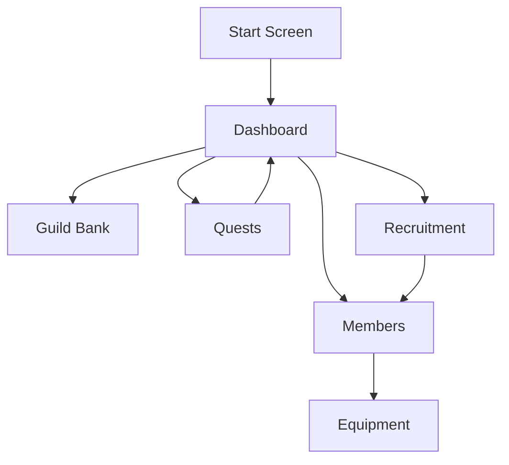

# Guild Manager Wiki

# Welcome to the Guild Manager project wiki.

This wiki will include information from my original README.md, the updated README.md which includes a technical architecture overview as well as a Changelog, and finally, include edited material not included in either of the previous README.md files.

Thank you to my friends in the industry who helped me with advice and guidance throughout this project.

# Project Outline (for submission)
## Project Description
The game mimics the daily actions of managing a guild: organizing members, dispatching quest parties, building notoriety, collecting items, and training members to become stronger.

## Problem Addressing
The project is designed for players who still enjoy game worlds and RPG progression but may not have time or energy for long play sessions. The goal is to create a casual experience that feels inspired by MMORPG guild management without requiring constant attention.

## Platform
The app is built for Android using Kotlin. The course is based on Android mobile development, so Android is the primary platform for development, testing, and deployment.

## Front/Back end support
This app uses Jetpack Compose instead of Java Fragments for the front end. 

The front end is contained within 2 folders:
- components
- screens

The back end is currently supported with static data being held in kotlin files, SQLite and a combination of the `GameManager.kt` and `SaveManager.kt` to manage persistence and data during runtime.

### Components

The Components folder holds one-time-use and reusable screen components that the app uses to draw screens. For example, `TopStatusBar.kt` pulls and displays the Guild Name, Gold, Fame, as well as holding a place for the Sidebar menu at the top left.

### Screens
This is where all the screens are laid out via `@Composable` functions, replacing XML files and Fragments. Jetpack Composes uses these functions to 
create what the user sees.

Screens are also managed by the `GuildManagerApp.kt` file, and use an enum stored in `models/AppScreen.kt` to easily assign a file from `/screens` to the appropriate display within the code.

## Functionality

- create a new guild or load demo data
- view guild progress from the Dashboard
- manage inventory in the Guild Bank
- view and manage guild members
- equip and unequip items
- send members on timed quests
- recruit new guild members
- save and load local progress

## Design (screenshots)

The current screens below replace the original wireframes and show the implemented user interface. All screenshots are stored in the `images` folder.

### Screen 1: Start Screen

The landing screen is the first view users see when launching the app. It establishes the guild-management theme and provides the entry point into the game.

### Screen 2: Dashboard

The Dashboard is the first screen users see after the Start Screen. It shows guild-level status, active progress, roster information, and bottom navigation for the main app sections.

The Dashboard also surfaces important updates, such as completed quest results and newly recruited members, so players can quickly understand what changed since their last action.

### Screen 3: Guild Bank Tab

The Guild Bank displays the guild inventory as a grid of items. Players can review collected equipment and resources from this screen.

Tapping an inventory item expands its details so the player can inspect item stats and understand how it may help the guild.

### Screen 4: Members Tab

The Members tab shows the recruited guild roster. Players can scroll through available members and review each member at a glance.

Tapping a member expands their card with additional details, including stats and member-specific information.

The equipment screen lets the player manage gear for a selected guild member and compare available inventory against equipped items.

### Screen 5: Quests Tab

The Quests tab displays available quests. The user can review quest options and choose a quest to inspect more closely.

Tapping a quest expands its details, requirements, rewards, and party assignment area.

After selecting guild members, the quest card shows assigned members and prepares the quest for dispatch.

Once dispatched, the quest moves into an in-progress state so the player can track active guild activity from the quest flow.

### Screen 6: Recruitment Tab

The Recruitment tab allows the user to review NPC applicants and decide whether to add them to the guild roster.

Tapping a potential recruit expands the applicant card with additional information before the player accepts or declines them.

## User Flow

